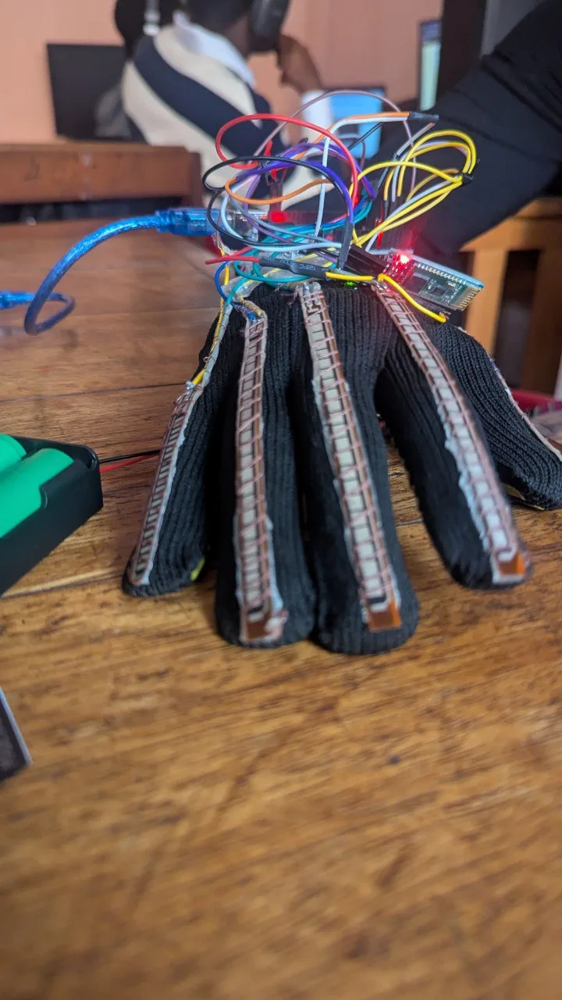

# Harmony Gloves

Ce dépôt contient les rapports du projet développé dans le cadre du cours Électronique et Interface. 

Ce projet consiste en la conception et la réalisation d’un gant qui va permettre de traduire la langue des signe en écrit.

## 📂 Contenu du Dépôt
Rapports :
- Rapport_Sem1.pdf : Présentation du prototype initial.

## 🎯 Objectifs Hebdomadaires
- Prototyper un gant capable de détecter détecter les mouvements des doigts et de la main.
- Assurer une communication fluide entre deux microcontrôleurs (Nano et UNO).
- Afficher les données collectées sur un écran LCD.

## 🛠️ Technologie et Matériel
- Composants utilisés :
Arduino Nano,
Arduino UNO,
Capteurs Flex (x5),
Gyroscope,
Résistances (1 kΩ),
Écran LCD
- Logiciels :
IDE Arduino,
Proteus (Simulation)

## 🚧 Difficultés
- Absence de gyroscope dans la bibliothèque Proteus.
- Calibration des capteurs flex complexe.
- Organisation dense du câblage et gestion des interférences.

## 📜 Details
### Rapports :
Les rapports hebdomadaires se trouvent dans le dossier Rapports. Ils documentent en détail les étapes du projet.

### Simulation :
Le fichier de simulation Proteus (schema_proteus.pdsprj) peut être ouvert pour visualiser le schéma électronique.

### Code :
- Téléverser le code arduino_nano_code.ino sur l’Arduino Nano.
- Téléverser le code arduino_uno_code.ino sur l’Arduino UNO.
- Configurer les connexions comme décrit dans le schéma.

<!-- ## 🤝 Contributeurs -->
